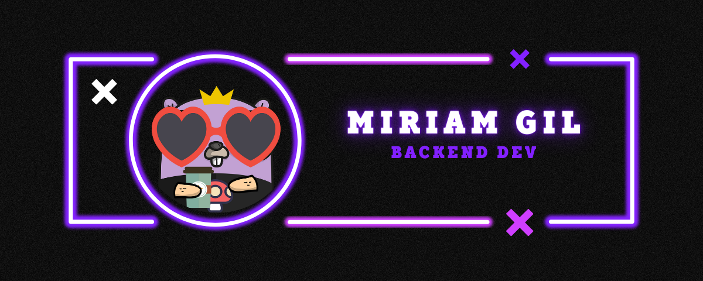

<h1>Hi there, I'm Miriam Gil 👋</h1>

## <picture></picture> About me

- 🔭 I’m currently working
  on 
- 👯 I’m looking to collaborate
  on 
- 🌱 I’m currently learning how to be a better and efficient developer
- 💬 Ask me about Go or any software development field, I'm eager to help

<h3 align="left">Languages and Tools:</h3>

     
     
     
     
     
     
     
     

<h3 align="left">Connect with me:</h3>

  
  

